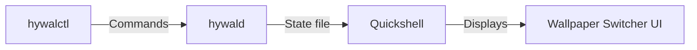

# HyWal

[](https://opensource.org/licenses/MIT)

Fast, daemon-powered wallpaper switcher for Hyprland built with Quickshell and Rust.

## Features

- ⚡ **Instant popup** - Wallpaper switcher appears instantly on keypress
- 🦀 **Persistent Rust daemon** - Low-overhead background service for wallpaper management
- ⌨️ **Keyboard driven** - Full navigation via keyboard
- 🖱️ **Mouse support** - Click to select wallpapers
- 🎨 **Matugen compatible** - Generates color schemes from wallpapers
- 🌌 **Caelestia integration** - Dynamic wallpapers from Caelestia
- 📁 **Configurable wallpaper directory** - Set your own wallpaper folders

## Screenshots

**Grid View Feature**

**Scroll View Feature**

**Search Feature**


## Installation

### Quick Install

```bash
git clone https://github.com/Pranavgitty/hywal.git
cd hywal
chmod +x install.sh
./install.sh
```

The installer will:
- Build the Rust daemon (`hywalctl` and `hywald`)
- Install binaries to `~/.local/bin`
- Install Quickshell configuration
- Set up Matugen integration
- Optionally install Caelestia integration if detected

**Requirements:**
- Rust toolchain (for building)
- Quickshell
- Hyprland
- Matugen (optional, for color generation)
- Aww wallpaper daemon (for dynamic wallpapers)

Make sure `~/.local/bin` is in your `PATH`.

### Manual Installation

1. Clone the repository
2. Build the daemon: `cd controller && cargo build --release`
3. Copy the binaries (`target/release/hywalctl` and `target/release/hywald`) to a directory in your `PATH`
4. Copy the `quickshell` directory to `~/.config/quickshell/hywal`
5. Install the Matugen templates from `templates/matugen/`
6. If Caelestia is present, install the optional integration scripts

## Usage

Start the daemon:
```bash
hywald
```

Toggle the wallpaper switcher:
```bash
hywalctl toggle
```
Or bind it to a key in your Hyprland config (e.g., `Super + W`):
```ini
bind = $mod W, exec hywalctl toggle
```

## Configuration

HyWal automatically creates a configuration file under `~/.config/quickshell/hywal/config.json`. Refer to `quickshell/config.json.example` for available options.

## Architecture



- **hywalctl**: Command-line client to control the daemon
- **hywald**: Persistent Rust daemon that manages wallpaper state
- **State file**: Shared state between daemon and UI
- **Quickshell**: Framework for the popup UI

## Roadmap

- [ ] Search functionality
- [ ] Favorite wallpapers
- [ ] Enhanced keyboard navigation
- [ ] Thumbnail caching for faster loading
- [ ] Smooth animations and transitions

## License

This project is licensed under the MIT License - see the [LICENSE](LICENSE) file for details.

## Acknowledgments

- [Quickshell](https://github.com/PrincetonUniversity/quickshell) - The UI framework
- [Matugen](https://github.com/varmd/matugen) - Color generation from images
- [Caelestia](https://github.com/PrincetonUniversity/caelestia) - Dynamic wallpaper engine
- [Hyprland](https://hyprland.org/) - The Wayland compositor that inspired this tool
