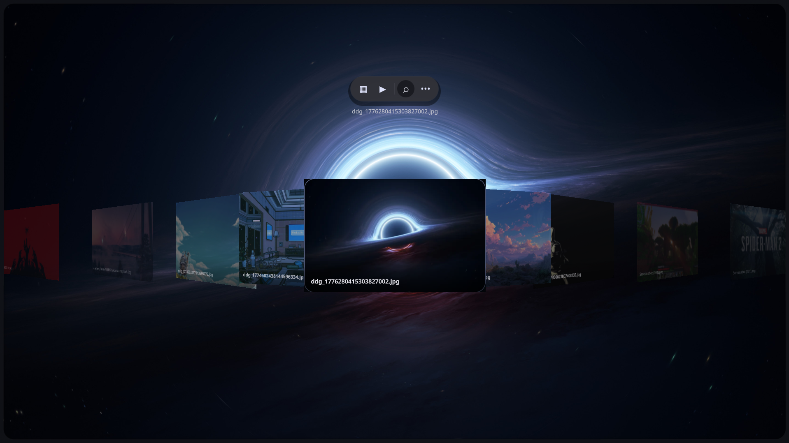
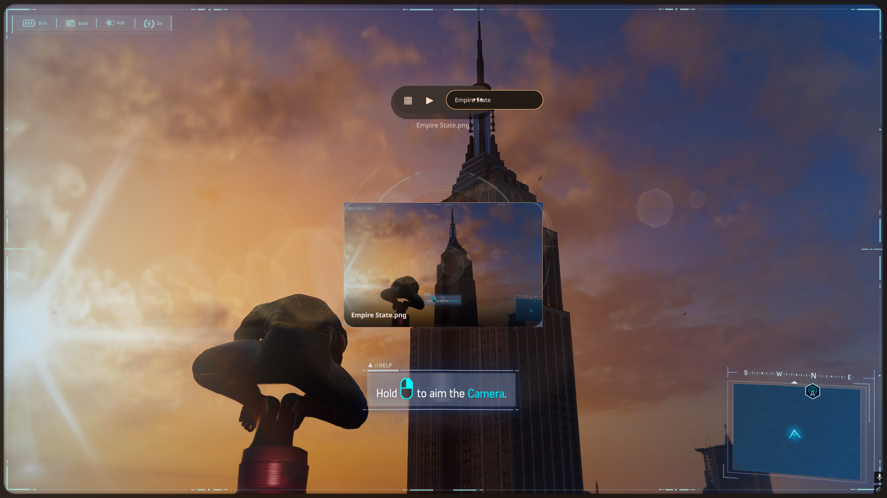
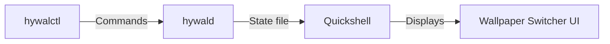

# HyWal

[](https://opensource.org/licenses/MIT)

Fast, daemon-powered wallpaper switcher for Hyprland built with Quickshell and Rust.

## Features

- ⚡ **Instant popup** - Wallpaper switcher appears instantly on keypress
- 🦀 **Persistent Rust daemon** - Low-overhead background service for wallpaper management
- ⌨️ **Keyboard driven** - Full navigation via keyboard
- 🖱️ **Mouse support** - Click to select wallpapers
- 🎨 **Matugen compatible** - Generates color schemes from wallpapers
- 🌌 **Caelestia integration** - Dynamic wallpapers from Caelestia
- 📁 **Configurable wallpaper directory** - Set your own wallpaper folders
- 🔍 **Search functionality** - Filter wallpapers by name
- ⭐ **Favorites support** - (Coming soon)
- 🎬 **Slideshow mode** - (Coming soon)

## Screenshots


**Grid View Feature**

**Scroll View Feature**

**Search Feature**


## Installation

### Quick Install

```bash
git clone https://github.com/Pranavgitty/hywal.git
cd hywal
chmod +x install.sh
./install.sh
```

The installer will:
- Build the Rust daemon (`hywalctl` and `hywald`)
- Install binaries to `~/.local/bin`
- Install Quickshell configuration
- Set up Matugen integration
- Optionally install Caelestia integration if detected
- Create default config at `~/.config/hywal/config.json`

**Requirements:**
- Rust toolchain (for building)
- Quickshell
- Hyprland
- Matugen (optional, for color generation)
- Aww wallpaper daemon (for dynamic wallpapers)

Make sure `~/.local/bin` is in your `PATH`.

### Manual Installation

1. Clone the repository
2. Build the daemon: `cd controller && cargo build --release`
3. Copy the binaries (`target/release/hywalctl` and `target/release/hywald`) to a directory in your `PATH`
4. Copy the `quickshell` directory to `~/.config/quickshell/hywal`
5. Install the Matugen templates from `templates/matugen/`
6. If Caelestia is present, install the optional integration scripts

## Usage

Start the daemon:
```bash
hywald
```

Toggle the wallpaper switcher:
```bash
hywalctl toggle
```
Or bind it to a key in your Hyprland config (e.g., `Super + W`):
```ini
bind = $mod W, exec hywalctl toggle
```

### CLI Commands

```bash
# Show help
hywalctl --help

# Toggle wallpaper switcher visibility
hywalctl toggle

# Show the wallpaper switcher
hywalctl show

# Hide the wallpaper switcher
hywalctl hide

# Reload wallpaper list
hywalctl reload

# Show current status
hywalctl status

# Apply a specific wallpaper by path
hywalctl apply /path/to/wallpaper.jpg
```

## Configuration

HyWal creates a configuration file at `~/.config/hywal/config.json`. See `quickshell/config.json.example` for available options:

```json
{
  "wallpaper_directory": "~/Pictures/Switcher",
  "state_directory": "~/.local/state/hywal",
  "animation_duration": 200,
  "default_view": "coverflow",
  "thumbnail_size": "860x540",
  "thumbnail_quality": 82
}
```

### Configuration Options

| Option | Default | Description |
|--------|---------|-------------|
| `wallpaper_directory` | `~/Pictures/Switcher` | Directory to scan for wallpapers |
| `state_directory` | `~/.local/state/hywal` | Directory for daemon state files |
| `animation_duration` | `200` | UI animation duration in milliseconds |
| `default_view` | `coverflow` | Default view mode (`coverflow` or `grid`) |
| `thumbnail_size` | `860x540` | Thumbnail resolution for caching |
| `thumbnail_quality` | `82` | JPEG/WebP quality for thumbnails (1-100) |

## Architecture



- **hywalctl**: Command-line client to control the daemon
- **hywald**: Persistent Rust daemon that manages wallpaper state
- **State file**: Shared state between daemon and UI (`~/.local/state/hywal/state`)
- **Quickshell**: Framework for the popup UI

## Uninstallation

```bash
./uninstall.sh
```

This will remove:
- Binaries from `~/.local/bin`
- Scripts from `~/.local/share/hywal`
- Config from `~/.config/quickshell/hywal` and `~/.config/hywal`
- State from `~/.local/state/hywal`
- Matugen integration entries
- Temporary socket and state files

## Roadmap

- [x] Search functionality
- [ ] Favorite wallpapers
- [x] Enhanced keyboard navigation
- [ ] Thumbnail caching for faster loading (implemented in scanner)
- [x] Smooth animations and transitions
- [x] Configurable wallpaper directory
- [ ] Multi-monitor wallpaper support
- [ ] Wallpaper history/recent

## License

This project is licensed under the MIT License - see the [LICENSE](LICENSE) file for details.

## Acknowledgments

- [Quickshell](https://github.com/PrincetonUniversity/quickshell) - The UI framework
- [Matugen](https://github.com/varmd/matugen) - Color generation from images
- [Caelestia](https://github.com/PrincetonUniversity/caelestia) - Dynamic wallpaper engine
- [Hyprland](https://hyprland.org/) - The Wayland compositor that inspired this tool